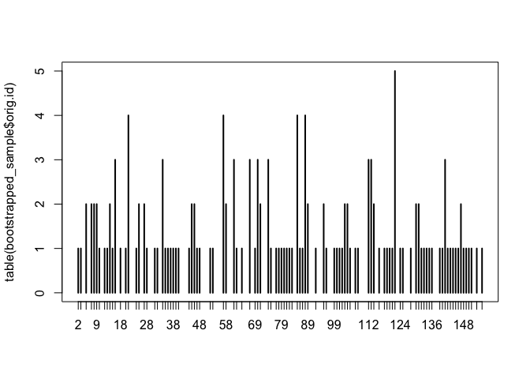
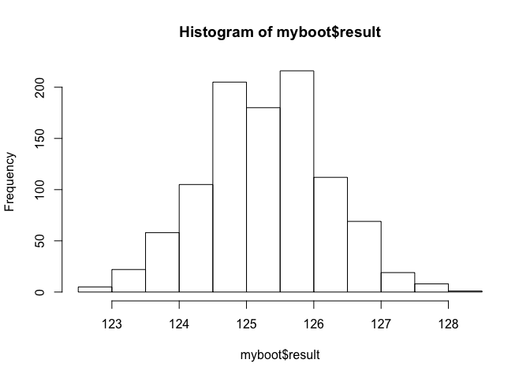
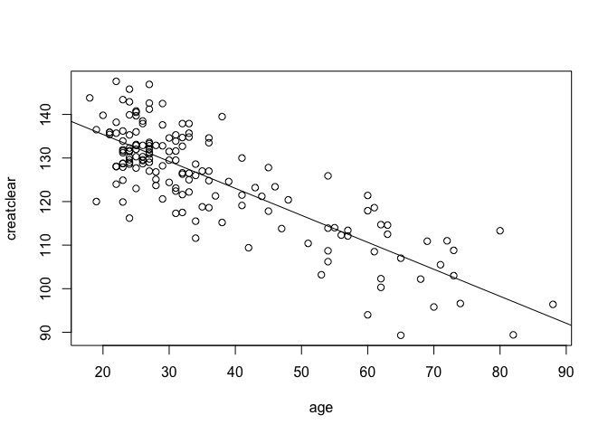
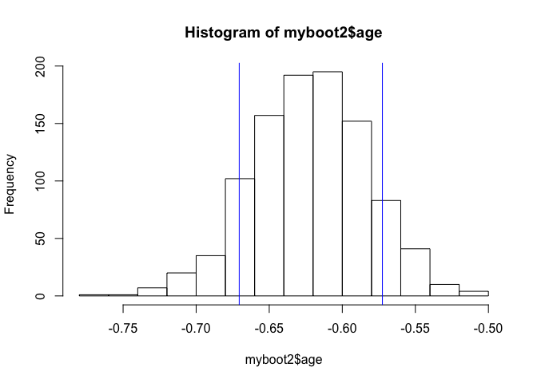
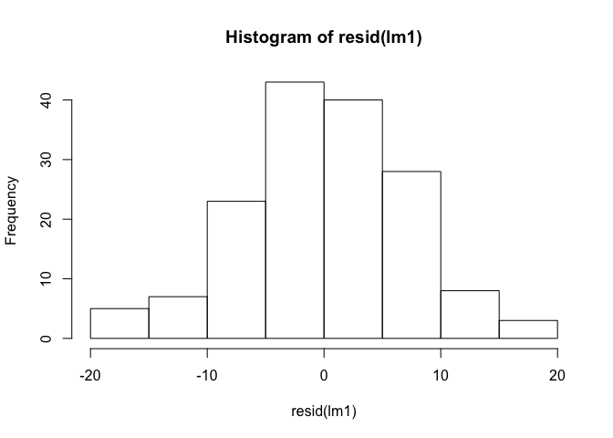
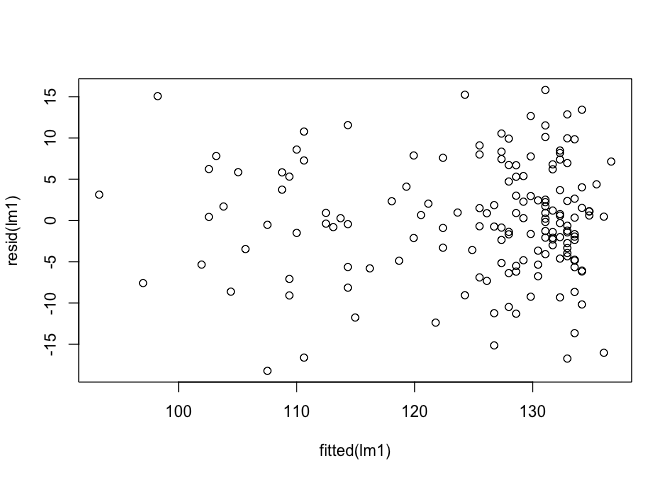

Approximating the sampling distribution by bootstrapping
--------------------------------------------------------

Learning goals:  
\* bootstrap the sample mean  
\* bootstrap the OLS estimator  
\* compute and interpret the bootstrapped standard error  
\* compute confidence intervals from bootstrapped samples

Data files:  
\*
[creatinine.csv](http://jgscott.github.io/teaching/data/creatinine.csv):
data on age and kidney function for 157 adult males from a single
clinic.

Load the mosaic library and then return to the creatinine data set,
which we recall had data on the age and kidney function for a sample of
men from a single clinic.

    library(mosaic)

    creatinine = read.csv('creatinine.csv', header=TRUE)
    summary(creatinine)

    ##       age          creatclear   
    ##  Min.   :18.00   Min.   : 89.3  
    ##  1st Qu.:25.00   1st Qu.:118.6  
    ##  Median :31.00   Median :128.0  
    ##  Mean   :36.39   Mean   :125.3  
    ##  3rd Qu.:43.00   3rd Qu.:133.3  
    ##  Max.   :88.00   Max.   :147.6

The two variables are  
\* age: the patient's age.  
\* creatclear: the patient's creatinine-clearance rate, measured in
ml/minute.

### Bootstrapped samples

We will start by addressing the following question. What can we say
about the average creatinine-clearance rate for the population of men
who attend this clinic, on the basis of this particular sample of 157?
The sample mean is easy enough to compute:

    creatclear_samplemean = mean(creatinine$creatclear)
    creatclear_samplemean

    ## [1] 125.2548

But we know that our sample mean of 125 won't exactly equal the
population mean. To quantify how far off our estimate is likely to be,
we would like to know the standard error of the sample mean. Moreover,
we'd like to know this without taking many more samples of 157 from the
population and seeing how the sample mean changes from one sample to the
next.

The idea of the bootstrap is to pretend that your sample represents the
whole population. We then take repeated "bootstrapped" samples from the
original sample. Each bootstrapped sample is defined by two
properties:  
1) It has the same size as the original sample.  
2) It is a sample with replacement from the original sample. Because we
sample with replacement, it is inevitable that our bootstrapped sample
will contain ties and omissions. That is, some points from the original
sample will get picked more than once, and some won't get picked at all.
This approximates the process of taking repeated real samples from the
whole population.

Let's see this in action. First, let's create a bootstrapped sample and
look at the first 20 data points. We'll do this using the `sample`
command.

    bootstrapped_sample = sample(creatinine, size = 157, replace=TRUE)
    head(bootstrapped_sample, 20)

    ##       age creatclear orig.id
    ## 21     73      108.8      21
    ## 53     32      137.9      53
    ## 144    45      117.8     144
    ## 130    32      126.6     130
    ## 148    25      123.0     148
    ## 135    74       96.6     135
    ## 108    24      131.7     108
    ## 93     21      135.9      93
    ## 119    25      140.8     119
    ## 57     61      118.6      57
    ## 133    43      123.2     133
    ## 18     34      128.6      18
    ## 115    54      113.9     115
    ## 46     31      133.9      46
    ## 144.1  45      117.8     144
    ## 60     39      124.6      60
    ## 41     23      128.7      41
    ## 80     37      121.3      80
    ## 24     23      133.9      24
    ## 31     32      117.5      31

If you look carefully, you may see a repeated entry in these first 20
rows. That's because our bootstrapped sample is a sample with
replacement from the original sample. You can visualize the pattern of
ties and omissions with the following plot:

    plot(table(bootstrapped_sample$orig.id))

The height of each bar shows how many times that original data point was
picked. The gaps show data points that were omitted.

There's actually a more concise way to draw bootstrapped samples using
the `resample` command, which we'll use from now on. Try executing the
following block of code 5 or 10 times to get a feel for the different
patterns of ties and omissions that arise in each bootstrapped sample.

    # same as sample(creatinine, size = 157, replace=TRUE)
    bootstrapped_sample = resample(creatinine)  
    plot(table(bootstrapped_sample$orig.id))

### Bootstrapping the sample mean

We're now ready to estimate the sampling distribution of the sample mean
by bootstrapping. Our basic procedure is:  
1) Take a bootstrap sample from the original sample.  
2) For this bootstrapped sample, we compute the sample mean of the
creatinine-clearance rate.

We repeat this process a large number of times (say, 1000 or more). The
key point is that, because each bootstrapped sample has a unique pattern
of ties and omissions, each will have a different sample mean. The
histogram of sample means across the bootstrapped samples then gives us
an idea of how the sample mean changes from sample to sample.

Try executing the following block of code 5-10 times to see the
different sample means you get for each bootstrapped sample.

    bootstrapped_sample = resample(creatinine)
    mean(bootstrapped_sample$creatclear)

    ## [1] 124.8217

The final trick is to use the `do` command to automatic the process of
taking repeated bootstrapped samples and computing the sample mean for
each one.

    do(10)*{
      bootstrapped_sample = resample(creatinine)  # same as sample(creatinine, size = 157, replace=TRUE)
      mean(bootstrapped_sample$creatclear)
    }

    ##      result
    ## 1  126.8019
    ## 2  123.8828
    ## 3  125.7191
    ## 4  126.9376
    ## 5  125.8873
    ## 6  124.5503
    ## 7  125.3854
    ## 8  124.3280
    ## 9  125.8242
    ## 10 124.7159

If this looks unfamiliar, try revisiting the ["Gone
fishing"](http://jgscott.github.io/teaching/r/gonefishing/gonefishing.html)
walkthrough to remind yourself of the logic of the `do(10)*` command.

Now we're ready. Let's take 1000 bootstrapped samples, compute the
sample mean for each one and visualize the results.

    # Take bootstrapped samples
    myboot = do(1000)*{
      bootstrapped_sample = resample(creatinine)  # same as sample(creatinine, size = 157, replace=TRUE)
      mean(bootstrapped_sample$creatclear)
    }
    # Visualize the sampling distribution and compute the bootstrapped standard error
    hist(myboot$result)

    sd(myboot$result)

    ## [1] 0.9392241

Because we have different bootstrapped samples, your histogram and
estimated standard error will look slightly different from mine. But
they should be relatively close.

Incidentally, if you repeatedly execute the above code block, you'll get
slightly different histograms and standard errors each time. We refer to
this variability as "Monte Carlo error," to distinguish it from the
standard error of the estimator itself. In principle, you can drive the
Monte Carlo error to virtually nothing by taking a very large number of
bootstrapped samples.

### Bootstrapping the OLS estimator

Once you get the hang of bootstrapping the sample mean, you can
bootstrap just about anything. As a specific example, we will
approximate the sampling distribution of the least-squares estimator for
the relationship between creatinine clearance rate and age:

    # Plot the data
    plot(creatclear~age, data=creatinine)
    # Fit a straight line to the data by least squares
    lm1 = lm(creatclear~age, data=creatinine)
    # Extract the coefficients and plot the line
    coef(lm1)

    ## (Intercept)         age 
    ## 147.8129158  -0.6198159

    abline(lm1)

Let's warm-up by computing the OLS estimator for a single bootstrapped
sample. Try executing this code block 5-10 different times:

    lm_boot = lm(creatclear~age, data=resample(creatinine))
    lm_boot

    ## 
    ## Call:
    ## lm(formula = creatclear ~ age, data = resample(creatinine))
    ## 
    ## Coefficients:
    ## (Intercept)          age  
    ##    146.4965      -0.6011

Notice how the slope and intercept of the fitted line change for each
sample.

To get a good idea of the sampling distribution for these quantities, we
want to repeat this many more than 5-10 times. Let's now use the `do`
command to automate the whole process and save the result.

    myboot2 = do(1000)*{
      lm_boot = lm(creatclear~age, data=resample(creatinine))
      lm_boot
    }
    # Inspect the first several lines
    head(myboot2)

    ##   Intercept        age    sigma r.squared        F numdf dendf .row .index
    ## 1  148.2290 -0.6327054 6.787903 0.6262125 259.6741     1   155    1      1
    ## 2  148.8770 -0.6332059 6.913182 0.6499207 287.7568     1   155    1      2
    ## 3  148.6194 -0.6349592 6.703134 0.6934170 350.5727     1   155    1      3
    ## 4  146.1254 -0.5865175 7.251837 0.6332982 267.6868     1   155    1      4
    ## 5  148.2196 -0.6398906 6.912309 0.7048450 370.1479     1   155    1      5
    ## 6  147.6896 -0.6231221 7.205105 0.6624543 304.1971     1   155    1      6

Notice that we have separate columns for the intercept, slope on the age
variable, sigma (the residual standard deviation), and R-squared. (Don't
worry about the "F" column for now.) Let's visualize the sampling
distributions for the intercept and slope.

    hist(myboot2$Intercept)

    sd(myboot2$Intercept)

    ## [1] 1.421574

    hist(myboot2$age)

    sd(myboot2$age)

    ## [1] 0.03839219

### Confidence intervals

We've met coverage intervals before. A coverage interval is an interval
that covers a specified percentage (say 80% or 95%) of a distribution.

A confidence interval for a parameter is nothing but a coverage interval
for that parameter's sampling distribution. For example, let's look more
closely at the sampling distribution for the slope on the `age` variable
that we just approximated by bootstrapping. We'll plot the histogram,
compute the endpoints of an 80% coverage interval, and show these
endpoints on the plot.

    hist(myboot2$age)
    myinterval = quantile(myboot2$age, probs=c(0.1, 0.9))
    abline(v = myinterval, col='blue')

    myinterval

    ##        10%        90% 
    ## -0.6702646 -0.5749208

We would refer to this interval as an 80% confidence interval for the
slope of the age variable in our regression model. (As above, your
numbers won't match mine exactly because of the randomness inherent to
bootstrapping. But they should be close.) Note that this confidence
interval is very different from an 80% coverage interval of the actual
ages in the underlying sample:

    quantile(creatinine$age, probs=c(0.1, 0.9))

    ## 10% 90% 
    ##  23  62

You can use the `confint` command to quickly get confidence intervals
for all model parameters:

    confint(myboot2, level=0.8)

    ##        name       lower       upper level     method    estimate
    ## 1 Intercept 146.0836313 149.6998619   0.8 percentile 147.8129158
    ## 2       age  -0.6702646  -0.5749208   0.8 percentile  -0.6198159
    ## 3     sigma   6.3414062   7.3740700   0.8 percentile   6.9105379
    ## 4 r.squared   0.6154664   0.7243072   0.8 percentile   0.6724361
    ## 5         F 248.0859838 407.2199786   0.8 percentile 318.1901588

You will notice that this gives a slightly different answer to the
confidence interval we calculated from the quantiles, above. That's
because the default behavior of the \`confint' function is to give a
confidence interval that is symmetric about the sample mean. That is, we
take the mean of the histogram and step out symmetrically to either side
until we cover 80% of the sampling distribution; we call this a
"central" confindence interval. The 80% interval we computed above, on
the other hand, contained exactly 10% of the bootstrapped samples in
each tail of the histogram; we call this an "equal-tail" confidence
interval. Neither is better than the other; they are simply different
conventions. In the special case where the underlying sampling
distribution is exactly symmetric, then the two conventions will give
the same answer.

### The normal linear regression model

Most statistical software packages have built-in routines for
calculating standard errors and confidence intervals, and will show them
as part of a routine summary output for a regression model. R is no
exception: the `summary` and `confint` functions do just this. For
example, if we fit the straight line to the creatinine-clearance data
and ask for a summary, we get a column of standard errors for each
parameter (here labelled "Std. Error"):

    lm1 = lm(creatclear~age, data=creatinine)
    summary(lm1)

    ## 
    ## Call:
    ## lm(formula = creatclear ~ age, data = creatinine)
    ## 
    ## Residuals:
    ##      Min       1Q   Median       3Q      Max 
    ## -18.2249  -4.6175   0.2221   4.7212  15.8221 
    ## 
    ## Coefficients:
    ##              Estimate Std. Error t value Pr(>|t|)    
    ## (Intercept) 147.81292    1.37965  107.14   <2e-16 ***
    ## age          -0.61982    0.03475  -17.84   <2e-16 ***
    ## ---
    ## Signif. codes:  0 '***' 0.001 '**' 0.01 '*' 0.05 '.' 0.1 ' ' 1
    ## 
    ## Residual standard error: 6.911 on 155 degrees of freedom
    ## Multiple R-squared:  0.6724, Adjusted R-squared:  0.6703 
    ## F-statistic: 318.2 on 1 and 155 DF,  p-value: < 2.2e-16

You can also use the `confint` function to get confidence intervals at a
specified level:

    confint(lm1, level = 0.95)

    ##                   2.5 %      97.5 %
    ## (Intercept) 145.0875702 150.5382614
    ## age          -0.6884549  -0.5511768

R is definitely not using the bootstrap to calculate these standard
errors and confidence intervals. So what is it doing instead? The short
answer is that it is calculating *Gaussian* standard errors and
confidence intervals, which are based on the assumption that the
residuals in the regression model follow a Gaussian, or normal,
distribution.

This is a deep topic that we won't treat in detail right now. For most
purposes, however, it’s fine to think of the confidence intervals
returned by R's default routines as just an approximation to the
bootstrapped confidence intervals you’ve become familiar with.

To be a bit more specific: if you want to rely on these Gaussian
confidence intervals, it would be wise to check the validity of the
normality assumption:  
- Do the residuals look normally distributed? (Make a histogram and
check whether the histogram looks normal.)  
- Do the residuals look like they have approximately constant variance?
(Plot the residuals versus the fitted values and look for telltale "fan"
shapes.)  
- Do the residuals look independent of each other? (Again, plot the
residuals versus the fitted values and look for patterns of correlation
in adjacent residuals.)

If the answer to any of these three questions is no, then you're
probably better off with the bootstrapped confidence intervals instead.
Otherwise the Gaussian-based confidence intervals are likely to be a
fine approximation.

Let's try these questions with the model above. First, do the residuals
look approximately normal? We will make a histogram and check:

    hist(resid(lm1))

It seems so. Second, do the residuals look like they have approximately
constant variance? We will plot the residuals versus the fitted values
and see whether there are any "fan" shapes:

    plot(resid(lm1) ~ fitted(lm1))

There are no fan shapes here; the residuals exhibit a similar scale of
variation regardless of the fitted value from the regression model.

The same plot above also gives us an answer to the third question: do
the residuals look independent of each other? We do not see any obvious
patterns of dependence, in which adjacent residuals look more similar to
each other than far-apart residuals.

Therefore, in light of the answers to these three questions, we are safe
to use the standard errors and confidence intervals from the Gaussian
(normal) model. You'll notice, in fact, that the bootstrapped confidence
intervals and the Gaussian confidence intervals are nearly identical:

    confint(myboot2)

    ##        name       lower       upper level     method    estimate
    ## 1 Intercept 145.1780197 150.7291912  0.95 percentile 147.8129158
    ## 2       age  -0.7025909  -0.5465182  0.95 percentile  -0.6198159
    ## 3     sigma   6.0970427   7.6388917  0.95 percentile   6.9105379
    ## 4 r.squared   0.5773234   0.7476787  0.95 percentile   0.6724361
    ## 5         F 211.7106819 459.2972818  0.95 percentile 318.1901588

    confint(lm1)

    ##                   2.5 %      97.5 %
    ## (Intercept) 145.0875702 150.5382614
    ## age          -0.6884549  -0.5511768
