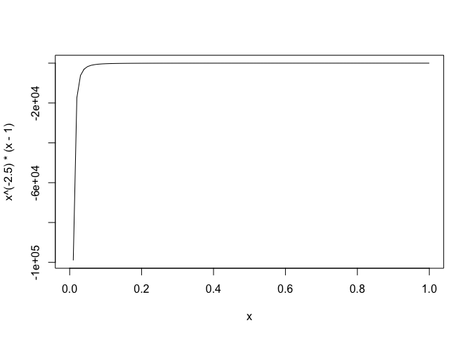
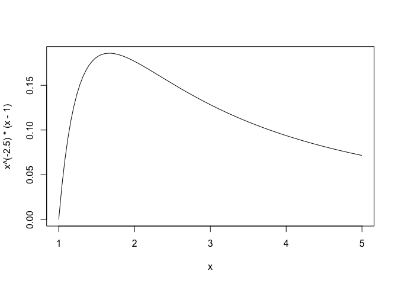
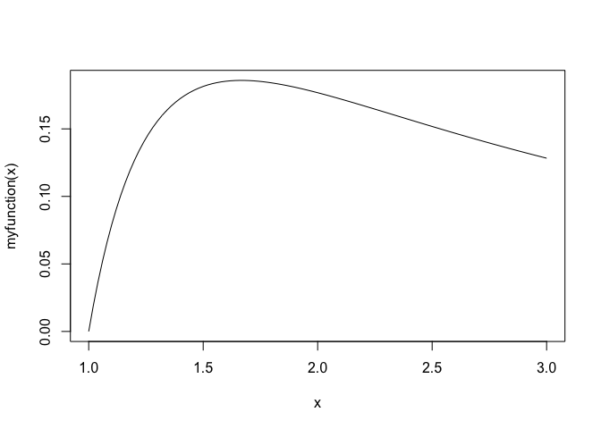
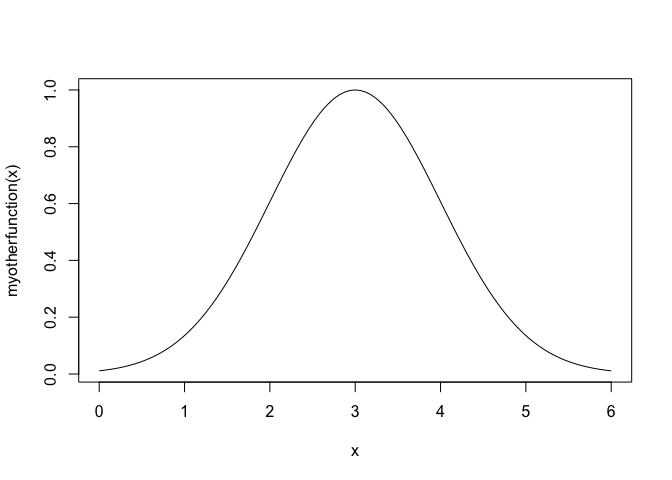

Optimizing a function in R
--------------------------

You'll often find yourself wanting to optimize some function, to find
either a minimum or maximum value. Let's see how to do this in R. You'll
need the mosaic library, so make sure to load it first:

    library(mosaic)

### Plot and point

As a simple case, we'll consider the function
*f*(*x*)=*x*−2.5(*x* − 1). Let's first plot this function:

    curve(x^(-2.5) * (x-1))

Why is this so ugly? It's because we're plotting this function over the
default domain from the `curve` function, which is \[0,1\]. Let's change
the domain to be plotted:

    curve(x^(-2.5) * (x-1), from = 1, to =5)

That's better! We can already see that the maximum is somewhere around
1.7. We can even zoom in further on this region:

    curve(x^(-2.5) * (x-1), from = 1.6, to = 1.8)

Just plotting and pointing ("hey, here's the optimum!") is enough to
tell us that this function obtains a maximum around *x* = 1.67.

### Using `makeFun` and `optimize`

As an alternative, you can follow a simple two-step process to get R to
optimize a function for you -- that is, without plotting and pointing.

First, you define your own function, using the mosaic library's
`makeFun` function. It works like this:

    myfunction = makeFun(x^(-2.5) * (x-1) ~ x)

On the left-hand side of the tilde (~) is the function f(x), and on the
right-hand side is that function's variable (x). This step creates a
*user-defined function* for R to optimize.

The second step is to call the `optimize` function on your own
user-defined function. The following code snippet says to find a maximum
of `myfunction` over the interval \[0,10\].

    optimize(myfunction, lower = 0, upper = 10, maximum = TRUE)

    ## $maximum
    ## [1] 1.666664
    ## 
    ## $objective
    ## [1] 0.1859032

The output tells you that the value of *x* at which your function
obtains a maximum is 1.6666 (rounded off), and that the value at that
point is *f*(*x*)=0.1859.

Three notes here:

First, you can call your user-defined function just like any other
function in R. For example:

    myfunction(4)

    ## [1] 0.09375

This tells you that the value your function takes at x=4 is f(x) =
0.09375.

Second, if you wanted to find the minimum, you would change "maximum =
TRUE" to "maximum = FALSE" in the above call to optimize. (Of course,
the function we chose is unbounded below, so it has no minimum.)

Third, in the above code, you are passing one function (`myfunction`) as
an argment to another function (`optimize`). This might make your head
spin a bit at first, but it's a perfectly valid thing to do. Many
functions in R, in fact, *expect* that their arguments are other
functions. `curve` is an example:

    curve(myfunction, from=1, to=3)

### A second example

Just to put all this together, let's maximize a different function,
*f*(*x*)=*e**x**p*(−0.5 \* (*x* − 3)2).

    myotherfunction = makeFun(exp(-0.5*(x-3)^2) ~ x)
    optimize(myotherfunction, lower = -10, upper = 10, maximum=TRUE)

    ## $maximum
    ## [1] 3
    ## 
    ## $objective
    ## [1] 1

This tells us that the maximum occurs at x=3 with value f(x) = 1, which
we can verify by plotting:

    curve(myotherfunction, from=0, to=6)

### Without the mosaic package

The `makeFun` command from the mosaic package is pretty intuitive for
defining simple functions. But you can do the same thing in "base" R.
Here's how to define your own function using `function` command:

    myfunction = function(x) {
      y = x^(-2.5) * (x-1)
      return(y)
    }

This is a little bit more verbose way of defining your own function, but
it's also more flexible. The basic structure is:  
1. Put the function's variables inside the parentheses of the `function`
definition, e.g. `myfunction = function(x)` here. These are called the
arguments of the function. Here is there is only one argument, called
x.  
2. Put executable commands between the braces {}. E.g. here we define a
new variable y, calculated from the argument (input) x that is passed to
the function whenever it gets called. Here the commands to be executed
are really short, but these can be as long or complicated as you want.  
3. The last line of the function should return whatever you want the
function to return---in this case, the variable y, representing the
value of the function at the input x.

Once we've done this, we have a callable function, e.g.

    myfunction(2)

    ## [1] 0.1767767

    myfunction(3.15)

    ## [1] 0.1220849

And `optimize` works exactly the same as it did before.

    optimize(myfunction, lower = 0, upper = 10, maximum = TRUE)

    ## $maximum
    ## [1] 1.666664
    ## 
    ## $objective
    ## [1] 0.1859032
